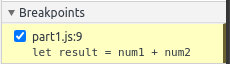
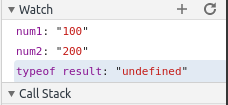
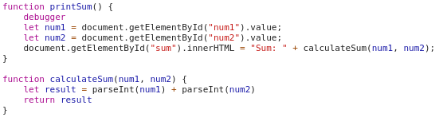

# CSE110 WI21 Lab 4 Part 3

## Part 1
Breakpoints: 
Watch Expressions: 

The bug was that the ``result`` variable was adding the string values of the numbers as opposed to their int values. this can be fixed by parsing the strings to their int values during addition.

## Part 2

1. The new json file is named citylots.json
2. The file that initiated the download was part2.js
3. The file's size is 11.7 MB.
4. It took 6.00 seconds to download.
5. The User-Agent for the browser was ``Mozilla/5.0 (X11; Linux x86_64) AppleWebKit/537.36 (KHTML, like Gecko) Chrome/87.0.4280.88 Safari/537.36``
6. The server type was Apache.
7. The file was last modified Tuesday, January 26th, 2021 at 22:14:13 GMT.
8. The Content-Type of the file is application/json.
9. The method inside the initiating file that made the request was fetchData() through calling fetch().